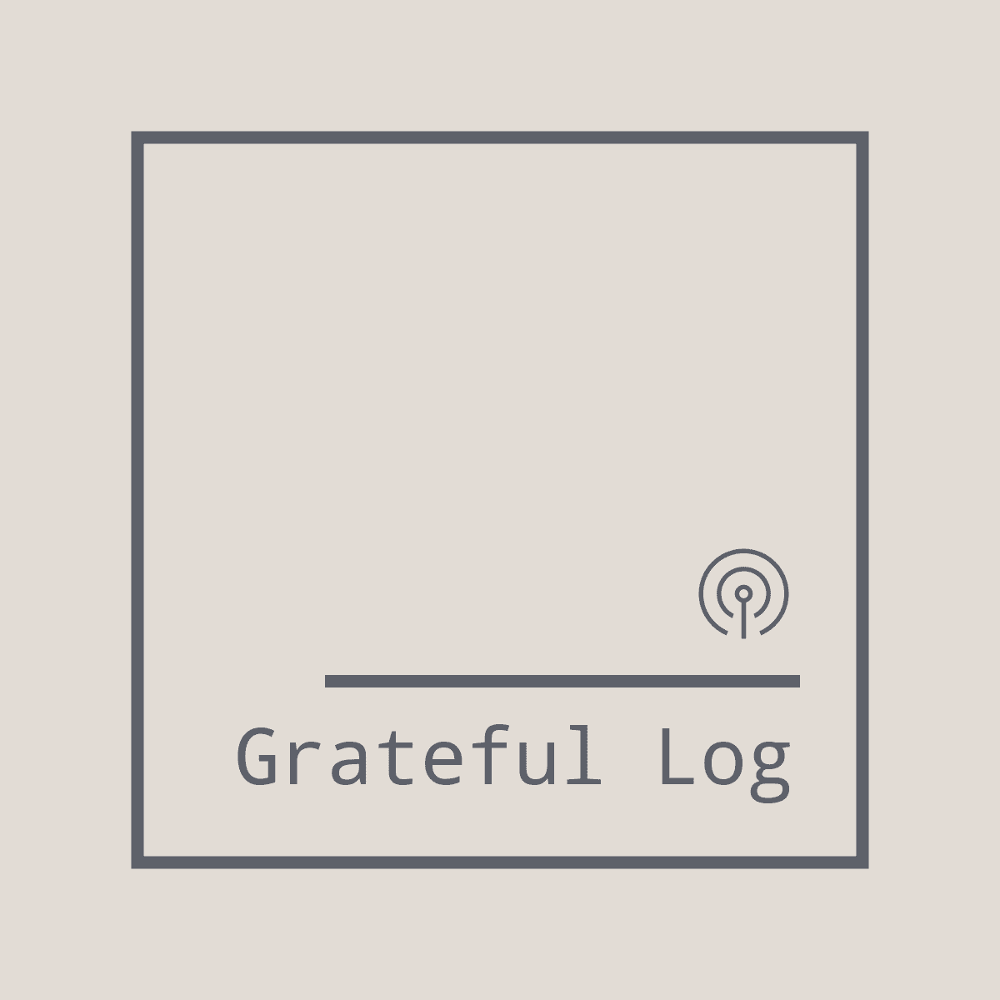

# The Grateful Log 🎙️

## Project's purpose

This project is meant to serve as a small reminder to allocate just one minute of your time per day to recording a voice memo.

It includes notifications with nudges to record a voice memo in a day but to also set a calendar based reminder whenever you want, just to hear what you were up to, a year or two years ago; who was there with you, what your state of mind was in the past. In the end, a reflection tool of sorts 😊. 

### What capabilities will the project have?
- Ability to set notifications in a time window (ex: once every 3 months) to hear your past recordings
- Ability to set notifications to prompt you to create a daily recording 
- You'll be able to also have a record collection of your past memos
- You'll can edit a recording provided that the editing is done in the same day
- You'll can delete past records
- You'll be able to upload a photo along next to the recording - the photo upload will be optional

> As far authentication goes, this will be done for the beginning just with a `Google account`. 

